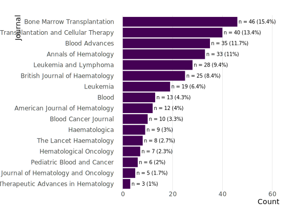

<!-- README.md is generated from README.Rmd. Please edit that file -->

```{r, include = FALSE}
knitr::opts_chunk$set(
  collapse = TRUE,
  comment = "#>",
  echo = FALSE,
  message = FALSE,
  warning = FALSE,
  fig.retina = 2,
  fig.path = "figures/"
)
```

# Handling missing covariate data in clinical studies in haematology

<!-- badges: start -->
<!-- badges: end -->

**Authors**: Edouard F. Bonneville, Johannes Schetelig, Hein Putter, and Liesbeth C. de Wreede

## Abstract

Missing data are frequently encountered across studies in clinical haematology. Failure to handle these missing values in an appropriate manner can complicate the interpretation of a study’s findings, as estimates presented may be biased and/or imprecise. In the present work, we first provide an overview of current methods for handling missing covariate data, along with their advantages and disadvantages. Furthermore, a systematic review is presented, exploring both contemporary reporting of missing values in major haematological journals, and the methods used for handling them. A principle finding was that the method of handling missing data was explicitly specified in a minority of articles (in 76 out of 195 articles reporting missing values, 39%). Among these, complete case analysis and the missing indicator methods were the most common approaches to dealing with missing values, with more complex methods such as multiple imputation being extremely rare (in 7 out of 195 articles). An example analysis (with associated code) is also provided using haematopoietic stem cell transplant data, illustrating the different approaches to handling missing values. We conclude with various recommendations regarding the reporting and handling of missing values for future studies in clinical haematology.

## Usage

The [data-raw/2022-09-06_ris.ris](./data-raw/2022-09-06_ris.ris) file corresponds to the raw corpus export from the OVID platform. The .ris file was thereafter imported into [Zotero](https://www.zotero.org/), and re-exported into a cleaner format - yielding the [data-raw/literature-database-raw.csv](./data-raw/literature-database-raw.csv). The aforementioned file formed the basis for the extraction sheet provided with the manuscript. 

Two main files are of interest:

- [analysis/illustrative-example.R](./analysis/illustrative-example.R) - the code corresponding to the illustrative example in the manuscript (comparison of imputation methods for event-free survival outcome).
- [analysis/review-analysis.R](./analysis/review-analysis.R) - provides the numbers reported in the review (requires the extraction sheet uploaded with manuscript).

```{r tree-test, comment=NA, eval=FALSE, echo=TRUE}
.
├── analysis
│   ├── illustrative-example.R
│   ├── review-analysis.R
│   └── zotero-to-extaction-sheet.R
├── data
│   └── imps_all.rds
├── data-raw
│   ├── 2022-09-06_ris.ris
│   ├── dat-mds_admin-cens.fst
│   ├── data_dictionary.rda
│   ├── extraction-sheet.xlsx
│   └── literature-database-raw.csv
├── figures
│   └── journals-overview.svg
├── hema-missing-review.Rproj
├── R
│   └── forest-helper.R
├── README.md
└── README.Rmd
```

```{r tree-example, comment=NA, eval=FALSE, echo=FALSE}
# Or paste as test after
#fs::dir_tree(
#  regexp = "\\.html$|\\.Rmd$|\\.Rproj$|imgs|libs|old|css|slides", 
#  invert = TRUE
#)
```

## Overview journals included in review


